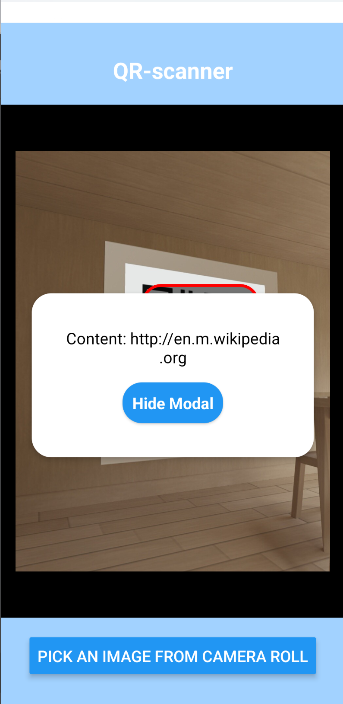
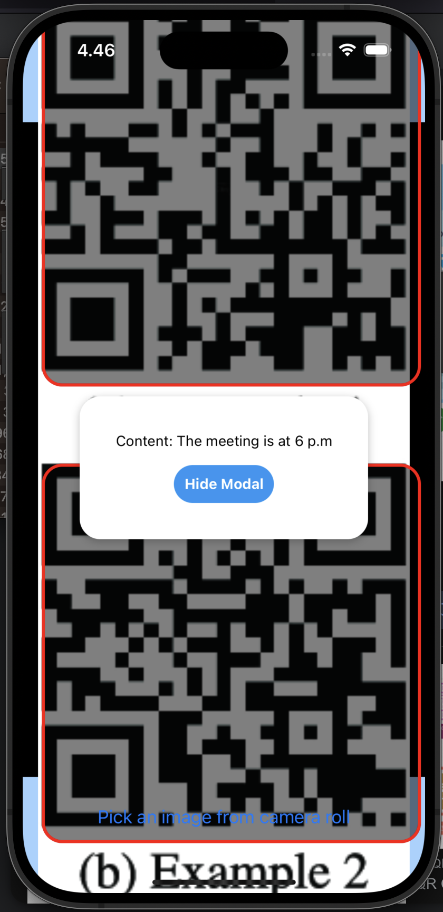

# expo-rust-demo

This is a QR code reading app made for Boosts Digital Sustainability Hackathon.
The app can open images from the callery and read QR-codes from them.
Image is processed in expo native module that uses Rust for processing.
The module returns the data from the QR-code and it's coordinates.
The app shows the locations of the QR-codes and by tapping them, you can see the data.

## Setup
- install rust
	- https://www.rust-lang.org/tools/install
- install dependencies
	- `npm i`

## iOS

- build rust library
	- `npm run cargo-ios`
- open an emulator or connect a device
- build and run app
	- `npm run ios`

## Android

- build rust library
	- `npm run cargo-android`
- open an emulator or connect a device
- build and run app
	- `npm run android`

## Examples

